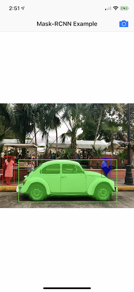
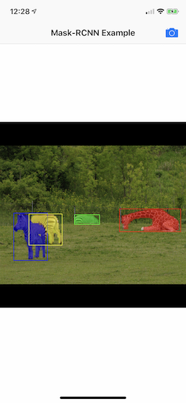

# Mask-RCNN for CoreML

Mask-RCNN using Core ML, Metal 2 and Accelerate.

<div align="center">

</div>

## Mask-RCNN

Mask-RCNN is a general framework for object instance segmentation. It detects objects, the class they belong to, their bounding box and segmentation masks.

## Motivation

Mask-RCNN is not fast, especially with the current ResNet101 + FPN backbone.

There are much faster models for object detection such as SSDLite and YOLO.

This model will only be useful if instance segmentation is valuable for your use-case.

## Examples





## Requirements

- Xcode 10.1
- iOS 12 or macOS 10.14 device with Metal support
- Swift 4.2
- (More requirements details coming soon)

### Requirements for using the scripts
- Docker
- (More requirements details coming soon)

## iOS Example Project Usage


1. Checkout or download this repository
2. Open a shell and navigate (cd) to the root of the repository
3. Download the pre-trained model files using the command:

```bash
$ swift run maskrcnn download example
```

4. Open Example/iOS Example.xcodeproj
5. Build and run on an iOS 12 device with Metal support

## Installation

### Cocoapods

Coming soon. See Roadmap. Install Manually instead.

### Carthage

Coming soon. See Roadmap. Install Manually instead.

### Swift Package Manager

Coming soon. See Roadmap. Install Manually instead.

### Manually

1. Import all of the Swift files in the Sources/Mask-RCNN-CoreML/ directory
2. If you have your own data to train or fine-tune a model, or if you have your own model weights, see Converting or training your own model. Otherwise, see Using COCO pre-trained model to use my model.

### Using COCO pre-trained model

1. Download the pre-trained model files from the [releases page](https://github.com/edouardlp/Mask-RCNN-CoreML/releases). (instructions for conversion coming soon)
2. Make the code you use is associated 
3. Drag the four files into your Xcode project (anchors.bin, MaskRCNN.mlmodel, Mask.mlmodel, Classifier.mlmodel)

## Converting or training your own model

If you have pre-trained model weights, or if you have data you want to train the model with, follow the instructions in this section.

### Converting pre-trained weights

At the moment, only models trained using [Matterport's Mask-RCNN implementation](https://github.com/matterport/Mask_RCNN) are supported. If your model is trained differently, you may be able to get it to work by renaming your weights following Matterport's naming structure and exporting your model to the Keras HDF5 format.

You should also specify configuration options in a JSON file.

- *architecture* : The backbone architecture your model is trained with. "resnet101" or "resnet50". Defaults to "resnet101".
- *input_image_shape* : The shape of the input image as a list of numbers. Defaults to [1024,1024,3].
- *num_classes* : The number of classes, including the background class. Defaults to 81.
- *pre_nms_max_proposals* : The number of proposed regions to evaluate using NMS. Only the top *pre_nms_max_proposals* proposals by score will be evaluated. Defaults to 6000.
- *max_proposals* : The number of proposals to classify. Only the top proposals by score, after NMS, will be evaluated. Defaults to 1000.
- More options to come

To use the default directory structure, place your files as such:

```
.maskrcnn/
    models/
        your_model_name/
            model/
                config.json
                weights.h5
```

The products of the conversion will be placed as such :

```
.maskrcnn/
    models/
        your_model_name/
            products/
                anchors.bin
                MaskRCNN.mlmodel
                Mask.mlmodel
                Classifier.model
```

Run :

```bash
$ swift run maskrcnn convert <your_model_name>
```

If you want to use input files located elsewhere, or to output the model to another directory, simply run :

```bash
$ swift run maskrcnn convert <your_model_name> --config=<path_to_config_file> --weights=<path_to_weights_file> --output_dir=<path_to_output_dir>
```

### Training or fine-tuning a model

This is not supported at the moment, but the next item in my roadmap.

## Evaluating the model accuracy

After conversion, or training you may want to evaluate the model accuracy.

At the moment, only the COCO dataset can be used for evaluation.

To use the default directory structure, place your files as such:

```
.maskrcnn/
    data/
        coco/
            the_coco_annotation_files.json
            type_year(ex: val2017)/
                the_images.jpg
    models/
        your_model_name/
            products/
                anchors.bin
                MaskRCNN.mlmodel
                Mask.mlmodel
                Classifier.model
```

Run : 

```bash
$ swift run maskrcnn eval coco <your_model_name> --year=<coco dataset year> --type=<coco dataset type ex : val>
```

If you want to compare against the model using Tensorflow, place the model files as such :

```
.maskrcnn/
    models/
        your_model_name/
            model/
                config.json
                weights.h5
```

Use -c to compare

```bash
$ swift run maskrcnn eval coco <your_model_name> -c --year=<coco dataset year> --type=<coco dataset type ex : val>
```

If you want to have your files in custom locations :

```bash
$ swift run maskrcnn eval coco <your_model_name> -c  --year=<coco dataset year> --type=<coco dataset type ex : val> --config=<path_to_config_file> --weights=<path_to_weights_file> --products_dir=<path_to_products_dir>
```

## Roadmap

- Training and fine-tuning support
- Cocoapods, Carthage, Swift Package manager and improved documentation
- Mobile-optimized backbone and other performance optimizations
- Easy training support
- Support for custom evaluation datasets
- Support for pose estimation

## Author

Édouard Lavery-Plante, ed@laveryplante.com

## Credits

- [Original Paper](https://arxiv.org/abs/1703.06870)
- [Matterport Implementation](https://github.com/matterport/Mask_RCNN/)
- [Inspiration](http://machinethink.net/blog/)

## References

- [Vision Framework](https://developer.apple.com/documentation/vision)
- [CoreML Framework](https://developer.apple.com/documentation/coreml)
- [coremltools](https://pypi.python.org/pypi/coremltools)
